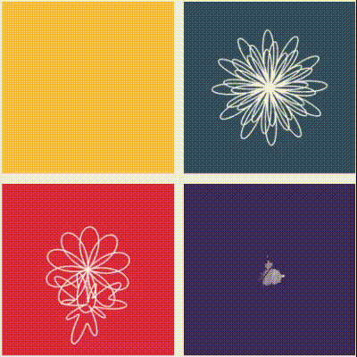

### Instructions
- Save repository to file system, then open `canvas.html` in browser

### canvas.html
- Example project utilizing rendering and matrix utils
- Use speed slider to change animation speed
- Click on first canvas for a surprise (also try clicking arrow keys)

### rendering_utils.js

- Boilerplate for shader and buffer initialization
- In buffer initialization, when parameter is not provided, GLSL attribute variable `gl_Position`defaults to `vPosition`. Attribute variable name for varying variable `fColor`(vertex colors) defaults to `vColor`. 

### matrix_utils.js
- Matrix prototype and transformations
- `setViewMatrix` aligns world coordinates to camera coordinates
- If you call`setViewMatrix`before transforming with `translateMatrix`|`scaleMatrix`|`rotateMatrix`, result will be `transformationMatrix * viewMatrix` instead of `viewMatrix * transformationMatrix`
- Properly handle view and transformations by creating a transformation matrix and a view matrix with `setViewMatrix`, then pass view matrix to transformation matrix `useViewMatrix(viewMatrix)`

### General Processing Flow
1. Get `html` canvas and `webgl` context
2. Compile shader source and link to shader program, then assign shader program to `webgl` context (`rendering_utils.js`)
3. Create buffer, bind buffer, write data, assign to attribute variable, then enable buffer assignment (`rendering_utils.js`)
4. Clear canvas 
5. Render